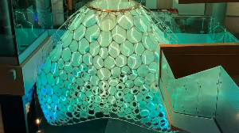
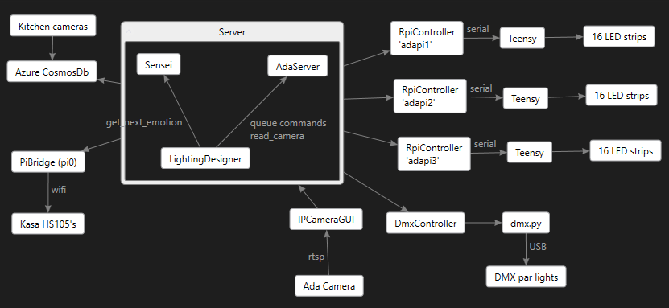

# Ada Design

Click the image below to see a live demo of the [Microsoft Research Ada project](https://www.microsoft.com/artist-in-residence/collaborations/ada/).

I'm helping to get Ada ready to welcome people back to building 99. Hopefully as the COVID-19
situation improves that won't be too much longer.  Ada is lots of fun to play with. The software
brings together a bunch of interesting parts...

AI cameras recognize [facial expressions](https://github.com/microsoft/FERPlus), the predictions go
to the Azure cloud, from there a server in building 99 orchestrates the lighting design which
includes all the LED inside Ada and some big DMX par lights to add more dramatic effects. The Server
sends the information to 3 [raspberry
pi](https://www.raspberrypi.org/products/raspberry-pi-3-model-b-plus/) devices which forward it on
to 3 [Teensy 4.0 devices](https://www.pjrc.com/store/teensy40.html) which drive the long LED strips
with very precise microsecond timing.

The whole thing is powered through 2 [Kasa HS105
switches](https://www.kasasmart.com/us/products/smart-plugs/kasa-smart-wifi-plug-mini) so the Server
can even put Ada to sleep every night.  These switches connect to a little [Raspberry Pi
Zero](https://www.raspberrypi.org/products/raspberry-pi-zero/) that is running a private wifi
network just for them and the pi zero communicates with the server.

There is also an Azure blob store for publishing new firmware for the Teensy's so we get some nice
over the air updating of the firmware when needed.