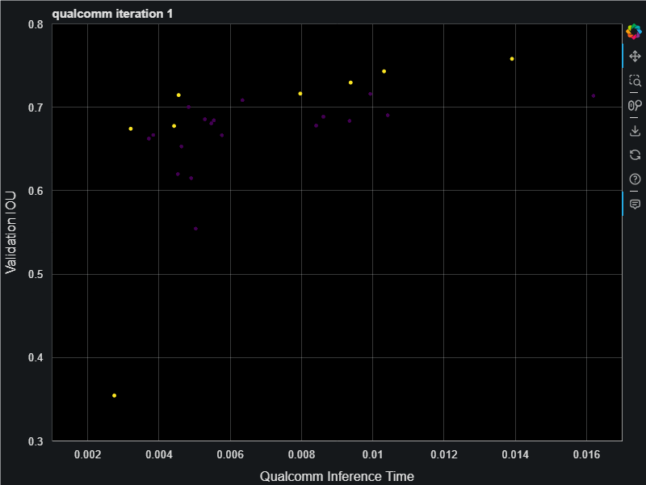
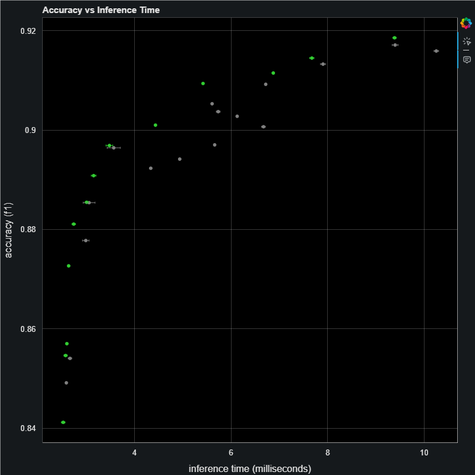

## Archai can find better models

So I've been working on this cool framework called [Archai](https://microsoft.github.io/archai/)
which can automate the process of finding better Neural Network model architectures.  I had lots of
fun hooking it up to Azure ML so we could run an end-to-end model search optimizing the models found
so they run well on Qualcomm 888 chipsets, specifically the DSP processor which runs a quantized
version of the model.

One fun example is a image segmentation model trained on a
[synthetic dataset](https://github.com/microsoft/FaceSynthetics):

These models can detect 19 categories of pixel including the background, skin, eyes, ears, nose,
lips, clothing, hair, beard, and so on all in about 2 milliseconds on the Qualcomm DSP chip which is
simply amazing to me.

First you define a [search
space](https://github.com/microsoft/archai/tree/main/tasks/face_segmentation) starting with a
baseline model architecture, then tell it to go!  We ran this in Azure using the Evolutionary Pareto
Search algorithm and it was fun to watch the models appear, steadly improving the pareto curve:

This resulting models that span 2.5ms all the way up to 15ms inference time.  When finished we do
full training on the final best models on the pareto frontier which gave us the following validation
scores.  This chart is showing validation accuracies.

So from 80% to almost 90% validation accuracy (measured as IOU score) and then we can test these
fully trained models on the Qualcomm devices to measure the F1 score:

Here the F1 score almost reaches 92% and the really fast models that are down under 2ms are still
above 84% accuracy.  This is super cool.  You can then pick whatever model from this pareto curve
satisfies your constraints based on latency budget or power usage that you need for your
application.

To reach about the full workflow on how we made all this happen in Azure ML
see the [readme](https://github.com/microsoft/archai/blob/main/tasks/face_segmentation/aml/readme.md)

The whole thing cost about $1000 in Azure training time, which may seem expensive, but that's only a
few hours for an "AI Whisperer" that is a red hot job market right now.  Besides if your model is
going into production and was taking 10ms before Archai search and is now taking 2ms, that 5 times
speedup will come back in inference dollars saved, or real customer satisfaction in terms of greatly
reduced battery usage on a phone, both are well worth the investment in Neural Architecture Search.