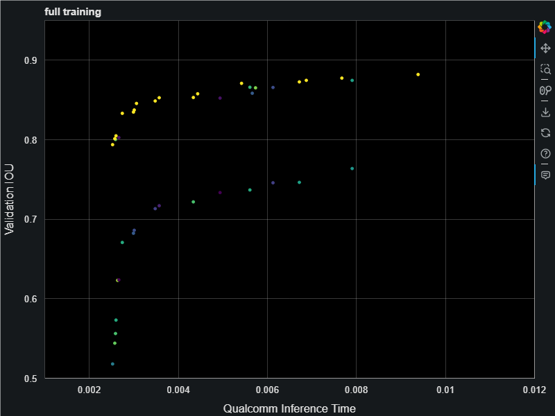

## Archai can find better models

So I've been working on this cool framework called [Archai](https://microsoft.github.io/archai/)
which can automate the process of finding better Neural Network model architectures.  I had lots of
fun hooking it up to Azure ML so we could run an end-to-end model search optimizing the models found
so they run well on Qualcomm 888 chipsets, specifically the DSP processor which runs a quantized
version of the model.

One fun example is a image segmentation model trained on a
[synthetic dataset](https://github.com/microsoft/FaceSynthetics):

These models can detect 19 categories of pixel including the background, skin, eyes, ears, nose,
lips, clothing, hair, beard, and so on all in about 2 milliseconds on the Qualcomm DSP chip which is
simply amazing to me.

First you define a [search
space](https://github.com/microsoft/archai/tree/main/tasks/face_segmentation) starting with a
baseline model architecture, then tell it to go!  We ran this in Azure using the Evolutionary Pareto
Search algorithm and it was fun to watch the models appear, steadly improving the pareto curve:

This resulting models have an inference time that span 2.5ms all the way up to 15ms.  When finished we do
full training on the final best models on the pareto frontier which gave us the following.
This chart is showing a nice jump up in the validation accuracies (measured as intersection over union (IOU) score)
resulting from full training.  The Archai search uses only partial training with only 1 epoch
in order to save on training costs.  For the search algorithm to find the best models it only needs
relative comparison on model accuracies and 1 epoch is enough to get those relative differences.

Now we have some fully trained models we can test these
models on the Qualcomm devices to measure the F1 scores:

Here the F1 score almost reaches 92% and the really fast models that are down under 2ms are still
above 84% accuracy. This is super cool. You can then pick a model from this pareto curve that
satisfies your constraints.  For example, some applications may have strick accuracy requirement,
some have a strick latency budget and power usage goal. For example, if your inference time budget
requires the model run in under 4ms then you will need to pick a model on the left of that time.
On the other hand if accuracy is all that matters you would pick the biggest slowest model on the right.
This is why Archai produces models on the entire pareto frontier. There is no one best model, it
depends on your application.

To read about the full workflow and how we made all this happen in Azure ML
see the [readme](https://github.com/microsoft/archai/blob/main/tasks/face_segmentation/aml/readme.md)

The whole thing cost about $1000 in Azure training time, which may seem expensive, but that's only a
few hours for an "AI Whisperer" which is a red hot job market right now.  Besides if your model is
going into production and was taking 10ms before Archai search and is now taking 2ms, that 5 times
speedup will come back in inference dollars saved, or real customer satisfaction in terms of greatly
reduced battery usage on a phone, both are well worth the investment in Neural Architecture Search.