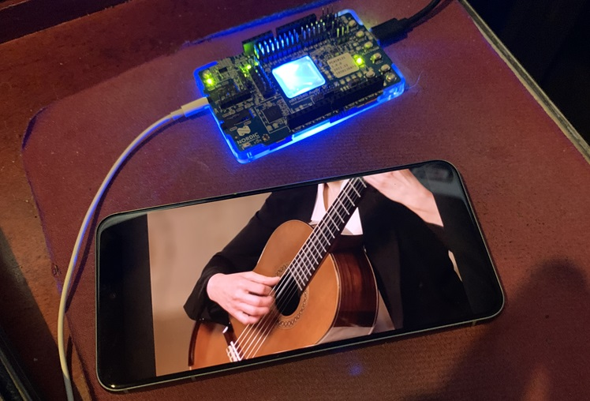
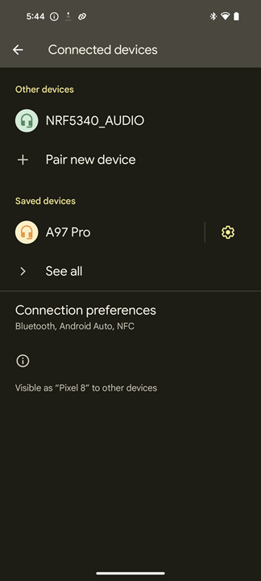

# Connecting nrf5340 audio devkit to Pixel 8 Android Phone

I was able to stream audio from my Pixel 8 phone phone running Android 14 to my [nrf5340 audio devkit](https://www.nordicsemi.com/Products/Development-hardware/nRF5340-Audio-DK).



Here you see the bluetooth pairing showing the phone connected to the devkit:



First you build the firmware as a headset with CONFIG_AUDIO_DEV=1 flash the firmware and ensure
it is advertising. You should see this in the console output:

```log
```log
         nRF5340 Audio nRF5340 Audio DK cpuapp                      
         NCS base version: 2.5.0                            
         Cmake run : Mon Dec 04 19:49:23 2023
HL [00:00:00.256,408] <inf> fw_info: ------- DEBUG BUILD -------
HL [00:00:00.256,408] <inf> fw_info: HEADSET left device
HL [00:00:00.267,059] <inf> board_version: Compatible board/HW version found: 1.0.0
HL [00:00:00.300,750] <inf> sd_card: SD card volume size: 30543 MB
HL [00:00:00.336,730] <inf> bt_mgmt: Clearing all bonds
HL [00:00:00.337,066] <inf> bt_mgmt_ctlr_cfg: Controller: LL_ACS_NRF53: Version 5.2 (0x0b), Revision 3393
HL [00:00:00.338,958] <inf> bt_mgmt: Local identity addr: E9:8C:6F:E2:D2:44 (random)
HL [00:00:00.370,025] <inf> bt_mgmt_adv: Local addr: 65:C3:C7:DE:D6:EA (random)
HL [00:00:00.370,513] <inf> bt_mgmt_adv: Advertising successfully started
```

Next on the Android phone you may need to enable developer mode, then make sure `Disable Bluetoioth LE audio` is not
enabled.  Then Click `Pair new device` under settings -> Connected devices and look for the one named `NRF5340_AUDIO`
and click pair.  You should see `streamctrl_unicast_server: Connected` appear in the log.  

```log
HL [00:00:57.231,292] <inf> streamctrl_unicast_server: Connected
HL [00:01:04.527,893] <inf> streamctrl_unicast_server: Security changed
HL [00:01:06.545,898] <inf> bt_content_ctrl_media: Discovery of MCS finished
HL [00:03:46.232,238] <inf> bt_rend_vol: Volume = 194, mute state = 0
HL [00:03:55.593,017] <inf> unicast_server: LC3 codec config for sink:
HL [00:03:55.593,017] <inf> unicast_server:     Frequency: 24000 Hz
HL [00:03:55.593,017] <inf> unicast_server:     Frame Duration: 10000 us
HL [00:03:55.593,048] <inf> unicast_server:     Channel allocation: 0x1
HL [00:03:55.593,048] <inf> unicast_server:     Octets per frame: 60 (48000 bps)
HL [00:03:55.593,078] <inf> unicast_server:     Frames per SDU: 1
HL [00:03:55.690,490] <inf> streamctrl_unicast_server: Presentation delay 10000 us is set by initiator
HL [00:03:56.498,077] <inf> unicast_server: Stream 0x20020e28 started
```
Here you can see it has negotiated a 24 kHz channel 1 stream. This is because I configured the 
nrf5340 devkit to run at 24kh because I was testing another device.  I'm sure it would also work great
at 48 kHz.

Click on the paired device settings icon and enable the switch titled `LE Audio`.  Now open a youtube video and if the
audio is coming out of the phone speakers then click the volume button, and click settings, then change the `Play Chrome
on` button from This Phone to `NRF5340_AUDIO` device.

Note that the nrf5340 chip acts as one channel, since normally you would have 2 chips for each earbud. So you will only
get the left channel in this case.  You can use 2 nrf5340 audio devkits to get full stereo.

THe log will show `Data received` and perhaps some under runs, but it is working fine and the audio sounds great through
some earbuds.

```log
HL [00:03:56.576,782] <inf> audio_datapath: Drft comp state: CALIB
HL [00:03:56.577,758] <wrn> audio_datapath: Data received, total underruns: 69
HL [00:03:56.676,757] <inf> audio_datapath: Drft comp state: OFFSET
HL [00:03:57.094,177] <wrn> audio_datapath: Data received, total underruns: 75
HL [00:03:57.114,196] <inf> audio_datapath: Drft comp state: LOCKED
HL [00:03:57.120,025] <inf> audio_datapath: Pres comp state: MEAS
HL [00:03:57.168,182] <wrn> audio_datapath: Data received, total underruns: 79
HL [00:03:57.246,490] <wrn> le_audio_rx: BLE ISO RX overrun
HL [00:03:57.256,469] <wrn> le_audio_rx: BLE ISO RX overrun
HL [00:03:57.256,713] <inf> audio_datapath: sdu_ref_us not from consecutive frames (diff: 29999 us)
HL [00:03:57.256,744] <inf> audio_datapath: Pres comp state: WAIT
HL [00:03:57.257,171] <wrn> audio_datapath: Data received, total underruns: 128
HL [00:03:57.356,567] <inf> audio_datapath: Pres comp state: INIT
HL [00:03:57.366,577] <inf> audio_datapath: Pres comp state: MEAS
HL [00:03:57.476,562] <inf> audio_datapath: Pres comp state: WAIT
HL [00:03:57.616,577] <inf> audio_datapath: Pres comp state: INIT
HL [00:03:57.626,586] <inf> audio_datapath: Pres comp state: MEAS
HL [00:03:57.729,187] <wrn> audio_datapath: Data received, total underruns: 141
HL [00:03:57.736,572] <inf> audio_datapath: Pres comp state: WAIT
HL [00:03:57.876,586] <inf> audio_datapath: Pres comp state: INIT
HL [00:03:57.886,566] <inf> audio_datapath: Pres comp state: MEAS
HL [00:03:57.996,582] <inf> audio_datapath: Pres comp state: WAIT
HL [00:03:58.156,494] <wrn> le_audio_rx: BLE ISO RX overrun
HL [00:03:58.166,503] <wrn> le_audio_rx: BLE ISO RX overrun
HL [00:03:58.170,837] <inf> audio_datapath: sdu_ref_us not from consecutive frames (diff: 30000 us)
HL [00:03:58.171,203] <wrn> audio_datapath: Data received, total underruns: 196
HL [00:03:58.172,607] <inf> audio_datapath: Pres comp state: INIT
HL [00:03:58.178,497] <inf> audio_datapath: Pres comp state: MEAS
HL [00:03:58.276,855] <inf> audio_datapath: Pres comp state: WAIT
HL [00:03:58.416,595] <inf> audio_datapath: Pres comp state: INIT
HL [00:03:58.426,574] <inf> audio_datapath: Pres comp state: MEAS
HL [00:03:58.536,590] <inf> audio_datapath: Pres comp state: LOCKED
HL [00:03:59.586,578] <inf> audio_datapath: sdu_ref_us not from consecutive frames (diff: 20000 us)
HL [00:03:59.586,608] <inf> audio_datapath: Pres comp state: WAIT
HL [00:03:59.588,195] <wrn> audio_datapath: Data received, total underruns: 198
HL [00:03:59.610,778] <wrn> bt_ascs: CCID 2 is unknown
HL [00:03:59.650,207] <wrn> audio_datapath: Data received, total underruns: 200
HL [00:03:59.726,501] <wrn> le_audio_rx: BLE ISO RX overrun
HL [00:03:59.736,511] <wrn> le_audio_rx: BLE ISO RX overrun
HL [00:03:59.746,490] <wrn> le_audio_rx: BLE ISO RX overrun
HL [00:03:59.748,413] <inf> audio_datapath: sdu_ref_us not from consecutive frames (diff: 39999 us)
HL [00:03:59.749,206] <wrn> audio_datapath: Data received, total underruns: 269
HL [00:03:59.751,068] <inf> audio_datapath: Pres comp state: INIT
HL [00:03:59.756,835] <inf> audio_datapath: Pres comp state: MEAS
HL [00:03:59.866,577] <inf> audio_datapath: Pres comp state: WAIT
HL [00:04:00.006,591] <inf> audio_datapath: Pres comp state: INIT
HL [00:04:00.016,601] <inf> audio_datapath: Pres comp state: MEAS
HL [00:04:00.126,586] <inf> audio_datapath: Pres comp state: LOCKED
HL [00:04:01.306,518] <wrn> le_audio_rx: BLE ISO RX overrun
HL [00:04:01.316,528] <wrn> le_audio_rx: BLE ISO RX overrun
HL [00:04:01.326,538] <wrn> le_audio_rx: BLE ISO RX overrun
HL [00:04:01.336,517] <wrn> le_audio_rx: BLE ISO RX overrun
HL [00:04:01.346,527] <wrn> le_audio_rx: BLE ISO RX overrun
HL [00:04:01.347,869] <inf> audio_datapath: sdu_ref_us not from consecutive frames (diff: 59996 us)
HL [00:04:01.347,900] <inf> audio_datapath: Pres comp state: WAIT
HL [00:04:01.348,205] <wrn> audio_datapath: Data received, total underruns: 351
HL [00:04:01.446,594] <inf> audio_datapath: Pres comp state: INIT
HL [00:04:01.456,604] <inf> audio_datapath: Pres comp state: MEAS
HL [00:04:01.566,619] <inf> audio_datapath: Pres comp state: WAIT
HL [00:04:01.706,604] <inf> audio_datapath: Pres comp state: INIT
HL [00:04:01.716,644] <inf> audio_datapath: Pres comp state: MEAS
HL [00:04:01.821,228] <wrn> audio_datapath: Data received, total underruns: 356
HL [00:04:01.829,223] <inf> audio_datapath: Pres comp state: WAIT
HL [00:04:01.829,193] <inf> audio_datapath: Saved 480000 bytes to wav file.
HL [00:04:01.966,613] <inf> audio_datapath: Pres comp state: INIT
HL [00:04:01.976,623] <inf> audio_datapath: Pres comp state: MEAS
HL [00:04:02.086,639] <inf> audio_datapath: Pres comp state: WAIT
HL [00:04:02.226,654] <inf> audio_datapath: Pres comp state: INIT
HL [00:04:02.236,602] <inf> audio_datapath: Pres comp state: MEAS
HL [00:04:02.346,618] <inf> audio_datapath: Pres comp state: LOCKED
HL [00:05:16.430,084] <wrn> audio_datapath: Data received, total underruns: 0
HL [00:05:16.483,154] <inf> audio_datapath: Pres comp state: MEAS
HL [00:05:16.484,100] <wrn> audio_datapath: Data received, total underruns: 53
HL [00:05:16.490,112] <inf> audio_datapath: Drft comp state: INIT
HL [00:05:16.491,088] <inf> audio_datapath: Drft comp state: CALIB
HL [00:05:16.493,133] <inf> audio_datapath: Pres comp state: INIT
HL [00:05:16.590,942] <inf> audio_datapath: Drft comp state: OFFSET
HL [00:05:16.634,948] <wrn> audio_datapath: Data received, total underruns: 54
HL [00:05:16.930,786] <inf> audio_datapath: Drft comp state: LOCKED
HL [00:05:16.933,166] <inf> audio_datapath: Pres comp state: MEAS
HL [00:05:17.043,151] <inf> audio_datapath: Pres comp state: WAIT
HL [00:05:17.183,166] <inf> audio_datapath: Pres comp state: INIT
HL [00:05:17.193,176] <inf> audio_datapath: Pres comp state: MEAS
HL [00:05:17.303,161] <inf> audio_datapath: Pres comp state: LOCKED
HL [00:06:43.983,703] <inf> audio_datapath: sdu_ref_us not from consecutive frames (diff: 389990 us)
HL [00:06:43.983,734] <inf> audio_datapath: Pres comp state: WAIT
HL [00:06:43.984,344] <wrn> audio_datapath: Data received, total underruns: 425
HL [00:06:44.085,357] <wrn> audio_datapath: Data received, total underruns: 426
HL [00:06:44.113,708] <inf> audio_datapath: Pres comp state: INIT
HL [00:06:44.123,718] <inf> audio_datapath: Pres comp state: MEAS
HL [00:06:44.233,734] <inf> audio_datapath: Pres comp state: WAIT
HL [00:06:44.373,718] <inf> audio_datapath: Pres comp state: INIT
HL [00:06:44.383,728] <inf> audio_datapath: Pres comp state: MEAS
HL [00:06:44.493,713] <inf> audio_datapath: Pres comp state: LOCKED
HL [00:06:47.333,740] <inf> audio_datapath: sdu_ref_us not from consecutive frames (diff: 159991 us)
HL [00:06:47.333,770] <inf> audio_datapath: Pres comp state: WAIT
HL [00:06:47.334,381] <wrn> audio_datapath: Data received, total underruns: 567
HL [00:06:47.435,394] <wrn> audio_datapath: Data received, total underruns: 568
HL [00:06:47.463,745] <inf> audio_datapath: Pres comp state: INIT
HL [00:06:47.473,754] <inf> audio_datapath: Pres comp state: MEAS
HL [00:06:47.583,740] <inf> audio_datapath: Pres comp state: WAIT
HL [00:06:47.723,754] <inf> audio_datapath: Pres comp state: INIT
HL [00:06:47.733,764] <inf> audio_datapath: Pres comp state: MEAS
HL [00:06:47.843,750] <inf> audio_datapath: Pres comp state: LOCKED
```

You can now go back to the bluetooth settings on the phone and tell it to forget this device
and it will disconnect and go back to advertising.

```log
HL [00:06:53.385,406] <inf> bt_mgmt: Disconnected: 94:45:60:6F:5D:66 (public) (reason 0x13)
HL [00:06:53.385,437] <inf> streamctrl_unicast_server: Disconnected
HL [00:06:53.385,467] <inf> unicast_server: Stream 0x20020e28 released
HL [00:06:53.386,047] <inf> bt_mgmt_adv: Local addr: 65:C3:C7:DE:D6:EA (random)
HL [00:06:53.386,138] <inf> bt_mgmt_adv: Adv directed to: 94:45:60:6F:5D:66 (public).
HL [00:06:53.386,779] <inf> bt_mgmt_adv: Advertising successfully started
HL [00:06:53.389,434] <inf> audio_datapath: Pres comp state: INIT
```
